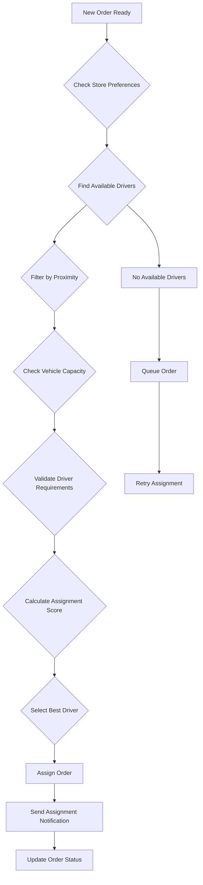
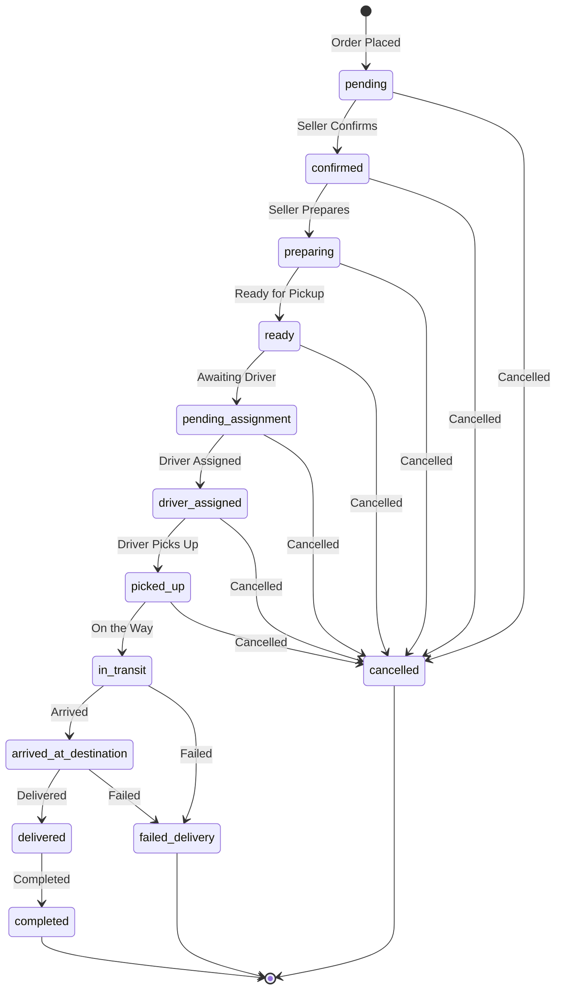

# Order Assignment and Status Tracking System Plan

## Overview
This document outlines the comprehensive plan for implementing an intelligent order assignment system and end-to-end status tracking for the delivery management system. This system will ensure efficient order-to-driver matching and provide real-time visibility into order status throughout the entire delivery lifecycle.

## System Components

### 1. Intelligent Order Assignment Engine
- **Purpose**: Automatically assign orders to the most suitable drivers based on various factors
- **Components**:
  - Driver availability tracking
  - Geospatial matching algorithms
  - Load balancing mechanisms
  - Priority-based assignment
 - Manual override capabilities

### 2. Order Status Lifecycle Management
- **Purpose**: Track orders through their complete lifecycle from placement to delivery
- **Components**:
  - Status transition validation
  - Automatic status progression
  - Status history tracking
  - Multi-party status visibility

### 3. Real-time Status Tracking Dashboard
- **Purpose**: Provide real-time visibility to all stakeholders
- **Components**:
  - Live order status updates
  - Driver location tracking
  - Estimated delivery times
  - Performance analytics

## Order Assignment System

### A. Assignment Criteria

#### 1. Primary Factors
- **Geographic Proximity**: Assign to the closest available driver
- **Driver Availability**: Only assign to drivers marked as available
- **Vehicle Capacity**: Match order size with driver vehicle capacity
- **Current Load**: Consider number of active deliveries per driver

#### 2. Secondary Factors
- **Driver Rating**: Higher-rated drivers for premium orders
- **Historical Performance**: Past delivery times and success rates
- **Special Requirements**: Match specific customer requirements
- **Time Windows**: Customer preferred delivery times

### B. Assignment Algorithm



### C. Assignment Process Flow

1. **Order Ready Check**: Verify order is in 'ready' status and has all required information
2. **Driver Discovery**: Find all available drivers within delivery radius
3. **Filtering**: Apply capacity, rating, and requirement filters
4. **Scoring**: Calculate assignment scores based on multiple criteria
5. **Selection**: Choose optimal driver based on scoring algorithm
6. **Assignment**: Create delivery assignment and notify driver
7. **Confirmation**: Wait for driver acceptance or implement fallback

### D. Fallback Mechanisms
- **Driver Declines**: Automatically assign to next best driver
- **No Available Drivers**: Queue order and retry periodically
- **Driver Issues**: Reassign to another driver during delivery
- **System Failures**: Manual assignment capability

## Status Tracking System

### A. Order Status Lifecycle



### B. Status Transition Rules

| Current Status | Valid Next Status | Authorization | Conditions |
|---|---|
| pending | confirmed, cancelled | seller | - |
| confirmed | preparing, cancelled | seller | - |
| preparing | ready, cancelled | seller | - |
| ready | pending_assignment | seller | Delivery assigned |
| pending_assignment | driver_assigned | system | Driver accepts |
| driver_assigned | picked_up | driver | - |
| picked_up | in_transit | driver | - |
| in_transit | arrived_at_destination | driver | - |
| arrived_at_destination | delivered, failed_delivery | driver | - |
| delivered | completed | system | Payment processed |
| cancelled | - | any | - |
| failed_delivery | - | system | - |

### C. Multi-Party Visibility

#### Customer View
- Order placement confirmation
- Seller preparation status
- Driver assignment
- Real-time tracking
- Delivery confirmation

#### Driver View
- Order assignment
- Pickup instructions
- Delivery route
- Status updates
- Delivery completion

#### Seller View
- Order received
- Preparation required
- Ready for delivery
- Delivery status
- Completion confirmation

#### Admin View
- Complete order lifecycle
- Performance metrics
- Issue resolution
- Analytics dashboard

## Technical Implementation

### A. Database Schema Enhancements

#### 1. Order Assignment Tracking
```javascript
// Enhanced order schema
deliveryAssignment: {
  deliveryId: ObjectId,
  assignedDriver: ObjectId,
  assignedAt: Date,
  assignedBy: ObjectId,
  assignmentAttempts: [{
    driverId: ObjectId,
    attemptTime: Date,
    result: String // 'accepted', 'declined', 'timeout'
  }],
  assignmentAlgorithm: String,
  assignmentScore: Number
}
```

#### 2. Status History Enhancement
```javascript
// Enhanced status history
statusHistory: [{
  status: String,
 timestamp: Date,
 updatedBy: ObjectId,
  updatedByRole: String, // 'customer', 'seller', 'driver', 'system', 'admin'
  location: {
    type: { type: String, enum: ['Point'] },
    coordinates: [Number]
  },
  note: String,
  proof: [String] // Photos, signatures, etc.
}]
```

### B. API Endpoints for Assignment

#### 1. Automated Assignment
```
POST /api/v1/orders/:id/assign-delivery
{
  "driverId": "ObjectId (optional)",
  "autoAssign": true,
  "maxAttempts": 5
}
```

#### 2. Manual Assignment
```
POST /api/v1/orders/:id/assign-delivery
{
  "driverId": "ObjectId (required)",
  "assignmentReason": "string"
}
```

#### 3. Assignment Preferences
```
PUT /api/v1/stores/:id/delivery-preferences
{
  "autoAssign": true,
 "maxDeliveryRadius": 10,
  "preferredDriverRating": 4.5,
  "assignmentPriority": "distance", // "distance", "rating", "availability"
  "timeSlots": [{
    "day": "monday",
    "startTime": "09:00",
    "endTime": "18:00"
  }]
}
```

### C. Real-time Updates

#### 1. WebSocket Events
- `order_status_update`: Real-time status changes
- `driver_assigned`: New driver assignment
- `eta_update`: Estimated time of arrival
- `delivery_progress`: Delivery progress updates

#### 2. Push Notifications
- Order assignment to driver
- Status changes to customer
- Delivery progress updates
- Exception notifications

## Business Rules

### A. Assignment Business Logic

#### 1. Load Balancing
- Max 3 active deliveries per driver
- Distribute orders fairly among available drivers
- Consider driver work hours and preferences

#### 2. Geographic Optimization
- Prioritize nearby drivers (within 5km)
- Consider traffic and road conditions
- Optimize for shortest total delivery time

#### 3. Quality Assurance
- Minimum driver rating for premium orders
- Track and improve delivery success rates
- Monitor and address delivery failures

### B. Status Management Rules

#### 1. Time-based Transitions
- Orders auto-move to 'ready' after preparation time
- Delivery timeouts trigger reassignment
- Unconfirmed deliveries auto-cancel after threshold

#### 2. Validation Requirements
- Location required for pickup/delivery confirmation
- Photo proof required for high-value orders
- Signature required for valuable items

#### 3. Exception Handling
- Failed delivery attempts trigger customer contact
- Delivery delays notify all parties
- Cancellations follow refund policies

## Performance Metrics

### A. Assignment Metrics
- Assignment success rate
- Average assignment time
- Driver acceptance rate
- Geographic efficiency

### B. Status Tracking Metrics
- Order completion rate
- Average delivery time
- Status update frequency
- Customer satisfaction scores

### C. System Performance
- API response times
- Real-time update latency
- Database query performance
- System uptime

## Integration Points

### A. Existing Systems
- Order management system
- Driver management system
- Customer notification system
- Payment processing system

### B. Third-Party Services
- Mapping and navigation services
- Push notification services
- Payment gateways
- Analytics platforms

## Security and Privacy

### A. Access Control
- Role-based access to assignment functions
- Secure driver authentication
- Customer data protection
- Audit logging for all changes

### B. Data Privacy
- Location data encryption
- Minimal data collection
- GDPR compliance
- Secure data transmission

## Error Handling and Recovery

### A. Assignment Failures
- Retry mechanisms with exponential backoff
- Fallback to manual assignment
- Customer notification of delays
- Alternative delivery options

### B. Status Tracking Issues
- Offline status updates sync
- Data consistency validation
- System health monitoring
- Automated recovery procedures

## Monitoring and Alerting

### A. System Health
- Assignment engine performance
- Status tracking accuracy
- API endpoint availability
- Database connection health

### B. Business Metrics
- Failed assignment alerts
- Delivery delays notification
- Customer complaint tracking
- Driver performance alerts

## Future Enhancements

### A. AI/ML Integration
- Predictive delivery time estimation
- Intelligent driver routing
- Demand forecasting
- Dynamic pricing models

### B. Advanced Features
- Multi-stop delivery optimization
- Drone delivery integration
- Autonomous vehicle coordination
- Advanced analytics dashboard

This comprehensive plan provides the foundation for implementing an efficient and effective order assignment and status tracking system that will enhance the delivery management capabilities of the platform.